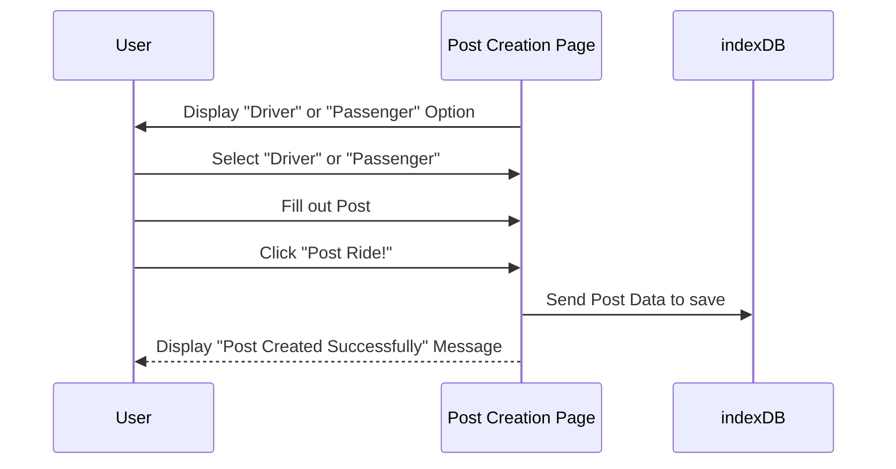

This is a sequence diagram for the Create Post page, The User selects Diver or Passenger for the forum selection. The user fills out the forum, when the user is done filling out the post the user clicks on "Post Ride!" and the forum gets stored with indexDB.

