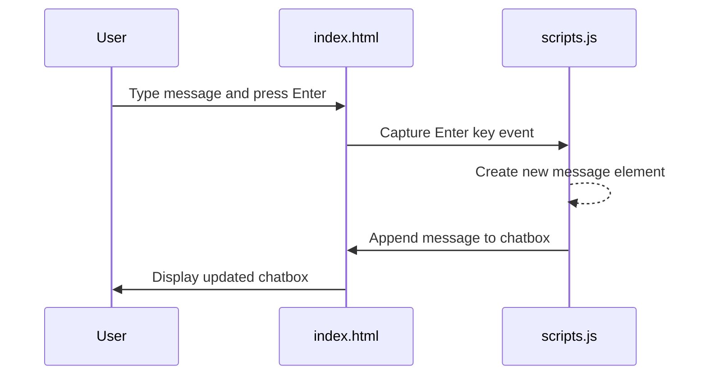

Below is a sequence diagram chat messaging on the front end, where users can type in a message and the inbox will dynamically load those messages. 
This feature was implemented collaboratively with Sammie Yu, who implemented the persistence of entered messages using indexedDB.

