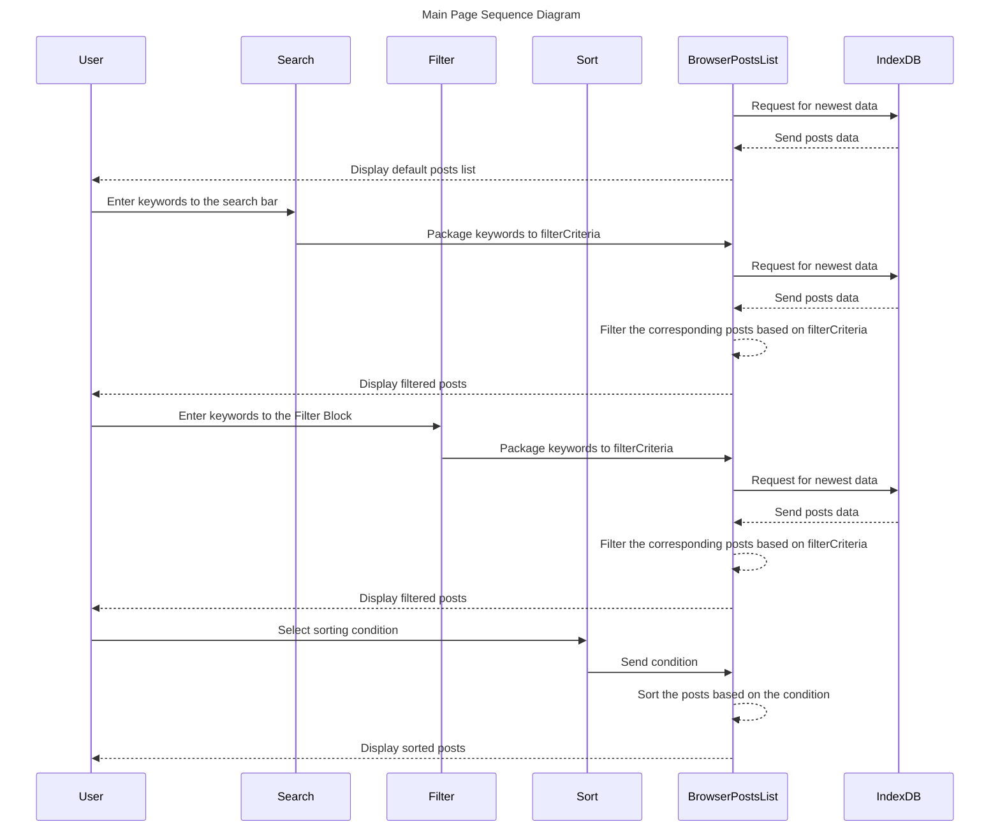

Below is a sequence diagram for Main-page on the front end, where users can see a series of posts and can use Search, Filter, and Sort to specify the showing list. 
Filter and Sort feature was implemented collaboratively with Lana vu.

