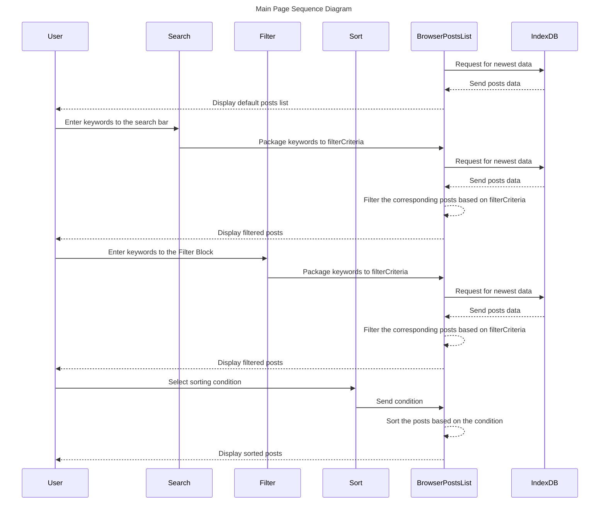

This is the sequence diagram for the main page of URide. It was implemented collaboratively with Jinghao Gao, who implemented the main page interface, while I did the filter/sort/search parts. 

```mermaid 
sequenceDiagram
    title Main Page Sequence Diagram

    participant User
    participant Search
    participant Filter
    participant Sort
    participant BrowserPostsList
    participant IndexDB

    BrowserPostsList ->> IndexDB: Request for newest data
    IndexDB -->> BrowserPostsList: Send posts data
    BrowserPostsList -->> User: Display default posts list

    User ->> Search: Enter keywords to the search bar
    Search ->> BrowserPostsList: Package keywords to filterCriteria
    BrowserPostsList ->> IndexDB: Request for newest data
    IndexDB -->> BrowserPostsList: Send posts data
    BrowserPostsList -->> BrowserPostsList: Filter the corresponding posts based on filterCriteria
    BrowserPostsList -->> User: Display filtered posts

    User ->> Filter: Enter keywords to the Filter Block
    Filter ->> BrowserPostsList: Package keywords to filterCriteria
    BrowserPostsList ->> IndexDB: Request for newest data
    IndexDB -->> BrowserPostsList: Send posts data
    BrowserPostsList -->> BrowserPostsList: Filter the corresponding posts based on filterCriteria
    BrowserPostsList -->> User: Display filtered posts

    User ->> Sort: Select sorting condition
    Sort ->> BrowserPostsList: Send condition
    BrowserPostsList -->> BrowserPostsList: Sort the posts based on the condition
    BrowserPostsList -->> User: Display sorted posts
```
