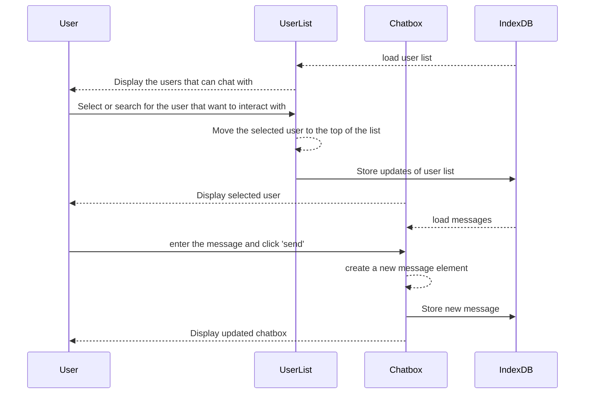

This is the sequence diagram for Chatbox Page of URide. It was implemented collaboratively with Gin Park, who implemented the dynamic Chatbox and dynamic responsiveness.

```mermaid
sequenceDiagram
    participant User
    participant UserList
    participant Chatbox
    participant IndexDB

    IndexDB -->> UserList: load user list
    UserList -->> User: Display the users that can chat with 
    User ->> UserList: Select or search for the user that want to interact with
    UserList -->> UserList: Move the selected user to the top of the list
    UserList ->> IndexDB: Store updates of user list
    Chatbox -->> User: Display selected user
    IndexDB -->> Chatbox: load messages
    User ->> Chatbox: enter the message and click 'send'
    Chatbox -->> Chatbox: create a new message element
    Chatbox ->> IndexDB: Store new message 
    Chatbox -->> User: Display updated chatbox
    
```
