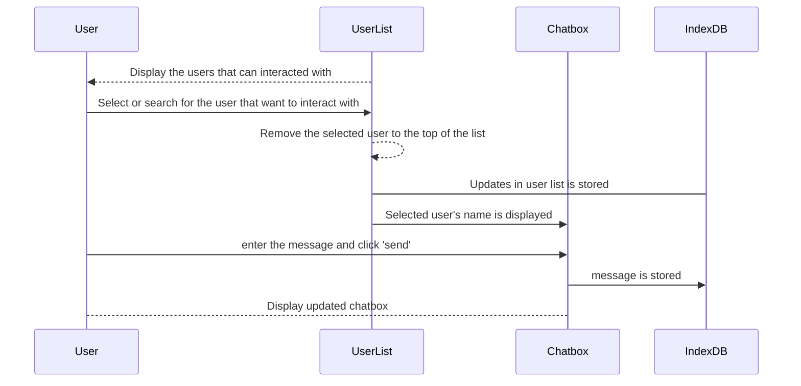

```mermaid
sequenceDiagram
    participant User
    participant UserList
    participant Chatbox
    participant IndexDB

    UserList -->> User: Display the users that can interacted with 
    User ->> UserList: Select or search for the user that want to interact with
    UserList -->> UserList: Remove the selected user to the top of the list
    UserList -> IndexDB: Updates in user list is stored
    UserList ->> Chatbox: Selected user's name is displayed
    User ->> Chatbox: enter the message and click 'send'
    Chatbox ->> IndexDB: message is stored
    Chatbox --> User: Display updated chatbox
    
```
